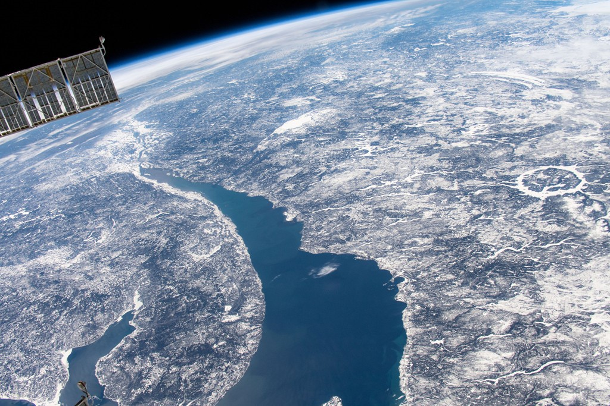
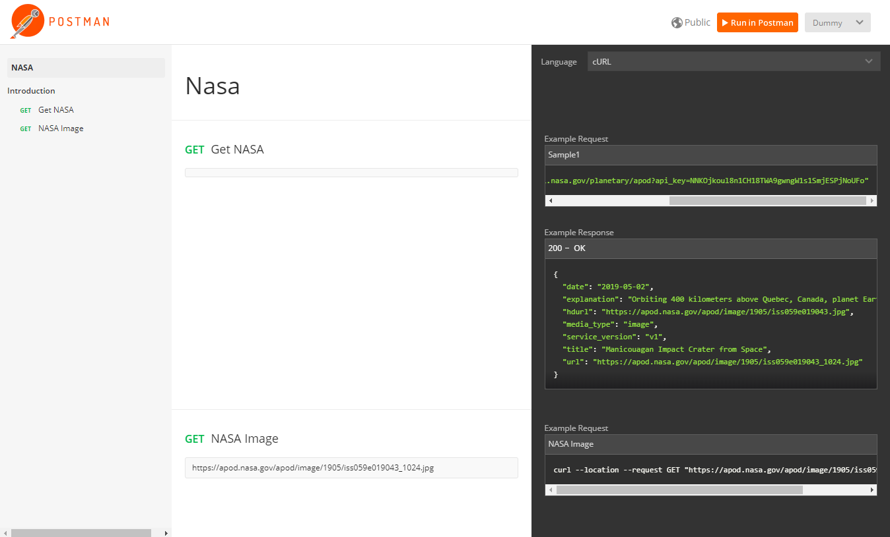
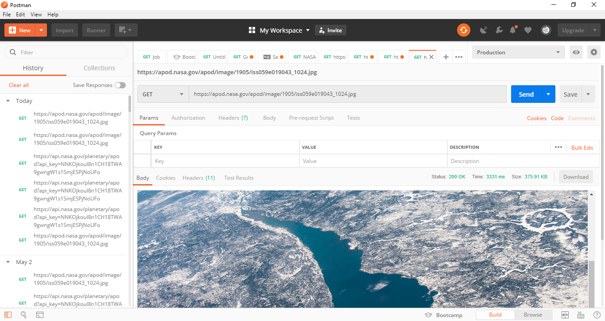

## Introduction to NASA

NASA – or the National Aeronautics and Space Administration, to give it its full name – is an American government agency focused on space exploration, aeronautics, and aerospace research.

## Scope of Document

Most developers getting started with api.nasa.gov wish to leverage NASA data in their applications and services, and this is encouraged. There are also developers that have existing APIs that they may wish to contribute to the NASA API site. This document consists of the only API documentation for NASA APOD (NASA Astronomy Picture of Day).

## NASA API APOD Portal

The objective of the NASA API (Application Programming Interface) site is to make NASA data, especially imagery, eminently accessible to application developers. When a user sends a request with APOD as an endpoint, the API responds to the user with the picture of the day from the NASA image repository.

## Authentication

Authentication is in place on api.nasa.gov to enable developers greater access to backend resources. Although api.nasa.gov web services can be accessed without an API key, this introduces limitations related to rate limiting of calls. To understand how to use your API key to sign calls, details about web service and `DEMO_KEY` rate limits, and viewing current usage, please visit the API authentication section on the NASA API listing page for detailed information.

### Web Service Rate Limits

Limits are placed on the number of API requests you may make using your API key. Rate limits may vary by service, but the defaults are:

- **Hourly Limit:** 1,000 requests per hour

For each API key, these limits are applied across all api.nasa.gov API requests. Exceeding these limits will lead to your API key being temporarily blocked from making further requests. The block will automatically be lifted by waiting an hour. If you need higher rate limits, contact us.

### DEMO_KEY Rate Limits

In documentation examples, the special `DEMO_KEY` api key is used. This API key can be used for initially exploring APIs prior to signing up, but it has much lower rate limits, so you're encouraged to sign up for your own API key if you plan to use the API (signup is quick and easy). The rate limits for the `DEMO_KEY` are:

- **Hourly Limit:** 30 requests per IP address per hour
- **Daily Limit:** 50 requests per IP address per day

## API Reference

The `api.nasa.gov/planetary/apod` is organized around REST (Representational State Transfer). This API has predictable, resource-oriented URLs, and uses HTTP response codes to indicate API errors.

### API Root / Base URL

```
https://api.nasa.gov
```

### API Resources

```
/planetary/apod
```

### Errors

Application api.nasa.gov uses conventional HTTP response codes to indicate the success or failure of an API request. In general, codes in the `2xx` range indicate success, codes in the `4xx` range indicate an error that failed given the information provided (e.g., a required parameter was omitted, a search failed, etc.), and codes in the `5xx` range indicate an error with our API servers (these are rare). Most error responses contain a reason attribute, a human-readable message providing more details about the error.

| Code | Explanation |
| --- | --- |
| `200` – OK | Everything worked as expected. |
| `400` – Bad Request | The request was unacceptable, often due to missing a required parameter. |
| `404` – Not Found | The requested resource does not exist. |
| `500`, `502`, `503`, `504` – Server Errors | Something went wrong on the API's end. (These are rare.) |

## APOD - Procedure for Request and Response

NASA APOD (NASA Astronomy Picture of Day). One of the most popular websites at NASA. In fact, this website is one of the most popular websites across all federal agencies. This endpoint structures the APOD imagery and associated metadata so that it can be repurposed for other applications.

### HTTP Request

```http
GET https://api.nasa.gov/planetary/apod?api_key=DEMO_KEY
```

### Request Breakdown

| Method | URL | Resource | Parameters |
| --- | --- | --- | --- |
| `GET` | `https://api.nasa.gov` | `/planetary/apod` | `?api_key=DEMO_KEY` |

> **Method** – Fetches the value.
> **Resource** – The resource typically refers to some object or set of objects that are exposed at an API endpoint.
> **Parameters** – Options you can pass with the endpoint (such as specifying the response format or the amount returned) to influence the response.

### Query Parameters

| Parameter | Type | Default | Description |
| --- | --- | --- | --- |
| `API_KEY` | `STRING` | `DEMO_KEY` | api.nasa.gov key for expanded usage |

## Sample Query and Response

### HTTP Request

| Method | Endpoint |
| --- | --- |
| `GET` | `https://api.nasa.gov/planetary/apod?api_key=NNKOjkoul8n1CH18TWA9gwngW1s1SmjESPjNoUFo` |

### Query Parameters

| Parameter | Type | Default | Description |
| --- | --- | --- | --- |
| `API_KEY` | `STRING` | `DEMO_KEY` | api.nasa.gov key for expanded usage |

### Response

**Status:** `200 OK`

```json
{
    "date": "2019-05-02",
    "explanation": "Orbiting 400 kilometers above Quebec, Canada, planet Earth, the International Space Station Expedition 59 crew captured this snapshot of the broad St. Lawrence River and curiously circular Lake Manicouagan on April 11. Right of center, the ring-shaped lake is a modern reservoir within the eroded remnant of an ancient 100 kilometer diameter impact crater. The ancient crater is very conspicuous from orbit, a visible reminder that Earth is vulnerable to rocks from space. Over 200 million years old, the Manicouagan crater was likely caused by the impact of a rocky body about 5 kilometers in diameter. Currently, there is no known asteroid with a significant probability of impacting Earth in the next century. But a fictional scenario to help practice for an asteroid impact is ongoing at the 2019 IAA Planetary Defense Conference.",
    "hdurl": "https://apod.nasa.gov/apod/image/1905/iss059e019043.jpg",
    "media_type": "image",
    "service_version": "v1",
    "title": "Manicouagan Impact Crater from Space",
    "url": "https://apod.nasa.gov/apod/image/1905/iss059e019043_1024.jpg"
}
```



## Results Validation in Postman

### Sending Request and Receiving Response



### Preview in Postman

